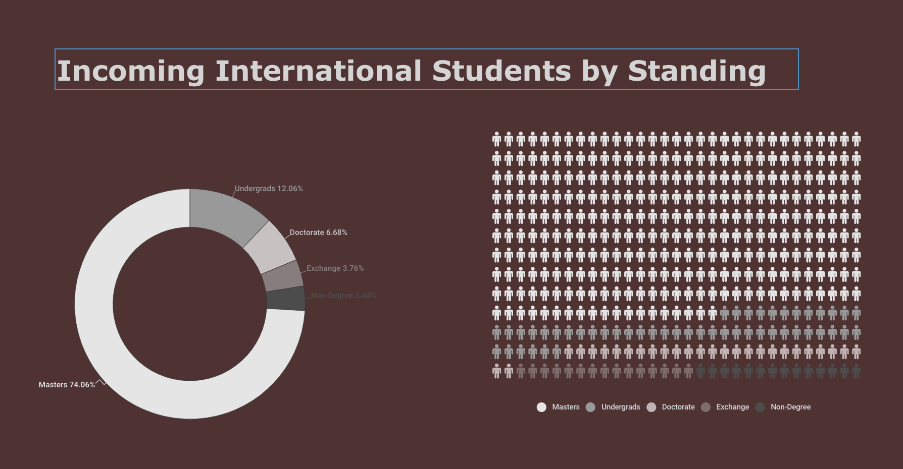
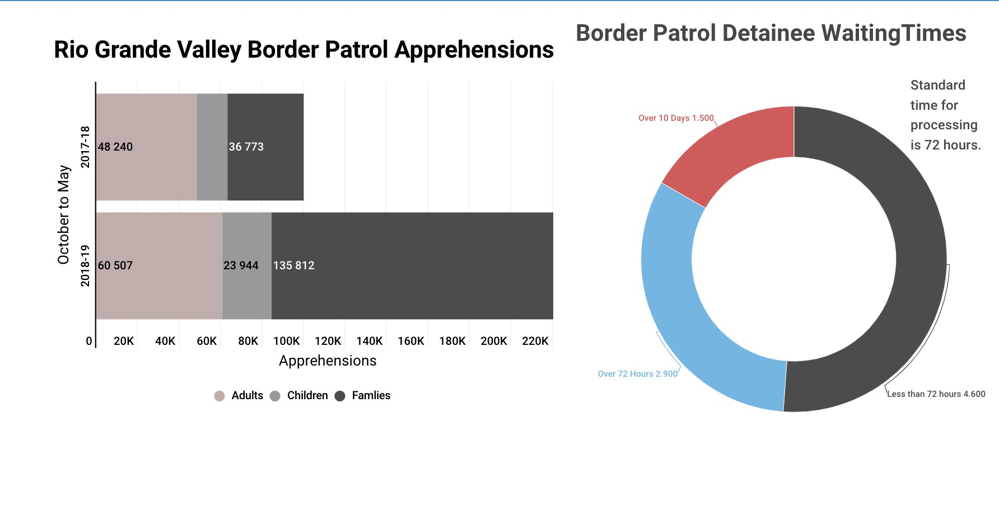
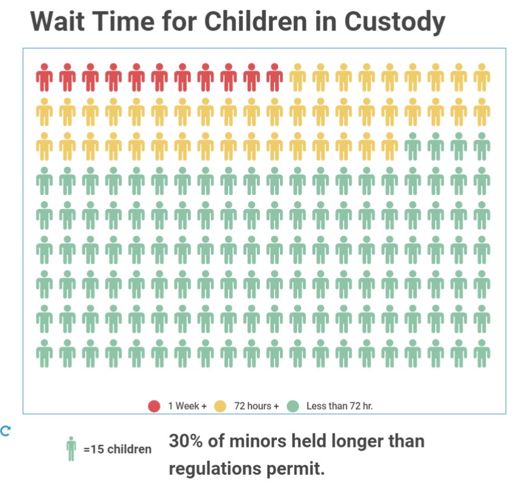

# EWalters-Portfolio
Test portfolio for class

https://elliottwalters.github.io/EWalters-Portfolio/

#About Me

My name is Elliott Walters. I am currently enrolled in the Telling Stories with Data class at CMU through the Heinz college. I work at CMU and a major part of my job involves talking about data with doctoral and masters students. I had some free time over the summer and thought a class like this might be beneficial for me to be able to provide some more guidance to students when we are working together and might help my work stand out more as well. He/Him/His

#What I Hope to Learn

Almost all of my professional writing and work comes out very bland. While the content is always there most of my graph and visualization do not look very interesting. I was thinking that taking a course like this might help me add some "pop" to my charts so that they stand out a bit more and start to make a bigger impact. I am especially interested in starting to use more color to help complex information be a little more intuative to my reader.

#Portfolio

Critique 1

<iframe title="Average Facebook Likes 2016" aria-label="Bar Chart" id="datawrapper-chart-YBKIR" src="//datawrapper.dwcdn.net/YBKIR/1/" scrolling="no" frameborder="0" style="width: 0; min-width: 100% !important; border: none;" height="479"></iframe>

Critique 2

Carnegie Mellon Universit: Office of International Education . (2019). Admission Statistic for Summer/Fall 2018. Retrieved from: https://www.cmu.edu/oie/about/docs/2018-admit-stats.pdf
 

While it is probably outside the scope of what can be done with the original document I decided to go with a uted color scale of greys, whites, and browns. I did not like the idea of color influencing information. That might be useful if someone is asking for money or trying to get ideas across, but here we are just trying to inform. I tried both a waffle chart and a pie chart. Looking at it now after the fact I should have added the exact total number of students on the inside of the donut chart. That is actually more important than the breakdown for most people reading this document. This is a mjor oversight on my part.

I might also pick another color for the non-degree seeking students as it does not show up very well. If I was doing this again I would also make the waffle chart to be 10 x 10 to get a better idea of how students were distributed with a key showing how many each single person represented. Overall not bad, definitely better than the original but lot of small mistakes.

I did two in infogram real quick to get an idea on how things might end up looking. Really basic chart but it highlights the biggest issue. The bars are way to fat though. It looked better on the site before I published it here.

<iframe title="Border Crossings Jump" aria-label="Column Chart" src="//datawrapper.dwcdn.net/pA6Fa/1/" scrolling="no" frameborder="0" style="border: none;" width="320" height="400"></iframe>
I decided to try stacked bars and I am happier with the results. The jump is very clear. Red for emphasis on the big jump. Not sure if I like the bold color or not.

<iframe title="Change in Border Crossing&nbsp; Apprehensions" aria-label="Stacked Bars" src="//datawrapper.dwcdn.net/mvLIq/1/" scrolling="no" frameborder="0" style="border: none;" width="600" height="176"></iframe>
This is where it ended up after going over it again. This is for the DHS side of the assignment and is an obvious quick call for more funding and fast.

This is more from a journalist perspective. To try and make it less abstract I used people for the waffle pieces and tried to go with a green yellow red set to match with street light feeling people are comfortable with. It is really close to the data used in the above donut chart but I like this more. It gives more weight to the numbers.
